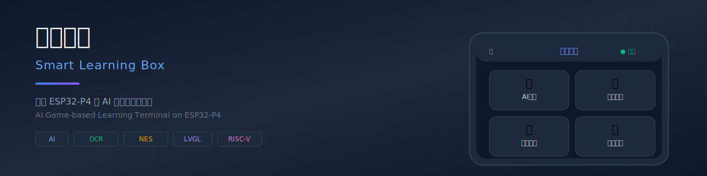
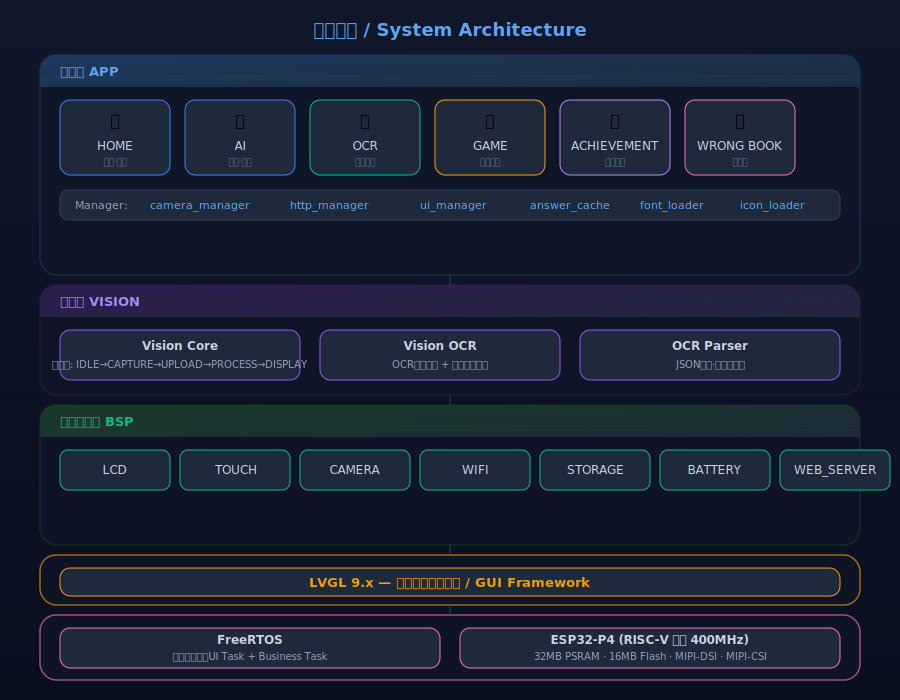
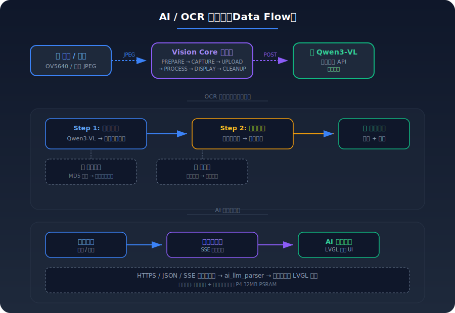
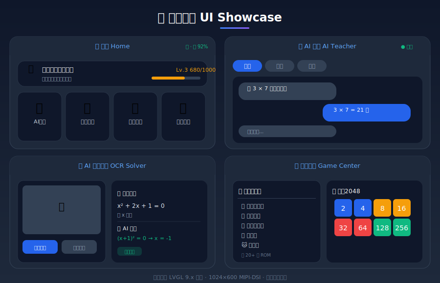

# 智趣宝盒 Smart Learning Box

<p align="center">
  
</p>

<p align="center">
  <a href="https://github.com/fish5723/smart-learning-box/blob/main/LICENSE"></a>
  <a href="https://docs.espressif.com/projects/esp-idf/en/latest/esp32p4/"></a>
  <a href="https://lvgl.io/"></a>
  <a href="#"></a>
  <a href="https://github.com/fish5723/smart-learning-box"></a>
</p>

<p align="center">
  <b>English</b> | <a href="#-中文">中文</a>
</p>

---

## 📖 English

**Smart Learning Box** is an AI-powered gamified learning terminal based on the **ESP32-P4** RISC-V dual-core microcontroller. It integrates AI tutoring, OCR problem-solving, NES game emulation, and an achievement system—bringing the experience of a "AI teacher + learning device + game console" into a single embedded device.

This project was developed for the **National College IoT Design Competition**.

### ✨ Features

| Module | Description |
|--------|-------------|
| 🤖 **AI Tutor** | LLM-powered Q&A (Qwen3-VL + Doubao), SSE streaming response, multi-subject support |
| 📷 **OCR Solver** | OV5640 camera → text recognition → AI solution (<10s full pipeline) |
| 🎮 **NES Emulator** | InfoNES core ported to MCU, 20-50fps, touch virtual gamepad, ROM & save management |
| 🏆 **Achievement System** | Points, levels, badges for gamified learning motivation |
| 📝 **Wrong Answer Book** | Auto-archive solved problems with AI explanations |
| 🎯 **Game Center** | 2048, Math Quiz, Word King, NES game launcher |

### 🧱 Architecture

<p align="center">
  
</p>

### 🔄 AI / OCR Data Flow

<p align="center">
  
</p>

### 📱 UI Showcase

<p align="center">
  
</p>

### 🛠 Hardware Specs

| Component | Specification |
|-----------|---------------|
| MCU | ESP32-P4 (RISC-V dual-core 400MHz, 32MB PSRAM) |
| Co-processor | ESP32-C6 (WiFi 6 / BLE 5, SDIO) |
| Display | 7" IPS 1024×600, MIPI-DSI, JD9165 driver |
| Touch | GT911 Capacitive Touch |
| Camera | OV5647, MIPI-CSI, 2592×1944 |
| Audio | MEMS mic + speaker (I2S/ES8311)（未实现） |
| Storage | 32GB TF card (FatFS) + 16MB NOR Flash |

### 🚀 Quick Start

```bash
# Prerequisites: ESP-IDF 5.5.x with esp32p4 support

git clone https://github.com/fish5723/smart-learning-box.git
cd smart-learning-box
idf.py set-target esp32p4
idf.py menuconfig   # Set LLM API Key in "Smart Box Configuration"
idf.py build
idf.py flash monitor
```

**Build size**: ~926KB binary | **PSRAM usage**: ~25.7%

### 📂 Project Structure

```
smart-learning-box/
├── main/
│   ├── app/          # Application layer (AI/OCR/GAME/HOME/Achievement)
│   ├── bsp/          # Board Support Package (LCD/Touch/Camera/WiFi/Storage)
│   ├── manager/      # Managers (UI/HTTP/Camera)
│   ├── vision/       # Vision pipeline core (state machine framework)
│   ├── common/       # Utilities (JSON/error codes/types)
│   └── fonts/        # Built-in Chinese fonts
├── components/       # Custom ESP-IDF components (JD9165 LCD driver)
├── assets/           # Assets (fonts/images/firmware/scripts)
├── UI/               # UI design mockups (EEZ exported HTML)
├── docs/             # Documentation
├── ROADMAP.md        # Development roadmap
└── CONTRIBUTING.md   # Contribution guide
```

### 📜 License

MIT License

---

## 🇨🇳 中文

<p align="center">
  
</p>

**智趣宝盒** 是一款基于 **ESP32-P4（RISC-V 双核 400MHz）** 的 AI 游戏化学习终端，集成了 AI 教师、OCR 拍照搜题、NES 游戏模拟器、成就系统等模块，在一台嵌入式设备上实现了"AI 教师 + 学习终端 + 游戏机"三合一体验。

本项目参加 **全国大学生物联网设计竞赛**。

### ✨ 功能一览

| 模块 | 说明 |
|------|------|
| 🤖 **AI 教师** | 对接大模型 API（Qwen3-VL + 豆包），SSE 流式对话，多学科支持 |
| 📷 **OCR 拍照搜题** | OV5640 拍照 → Qwen3-VL 文字识别 → 豆包解题推理，全链路 <10s |
| 🎮 **NES 模拟器** | 移植 InfoNES 内核，20-50fps，触摸虚拟手柄，ROM 加载 + 存档管理 |
| 🏆 **成就系统** | 积分、等级、徽章，游戏化学习激励 |
| 📝 **错题本** | 自动归档解答记录，AI 讲解辅助复习 |
| 🎯 **游戏中心** | 2048、数学闯关、单词王、NES 游戏启动器 |

### 🧱 系统架构

<p align="center">
  
</p>

### 🔄 AI / OCR 数据流

<p align="center">
  
</p>

### 📱 UI 展示

<p align="center">
  
</p>

### 🛠 硬件规格

| 组件 | 规格 |
|------|------|
| 主控 | ESP32-P4 (RISC-V 双核 400MHz, 32MB PSRAM) |
| 协处理器 | ESP32-C6 (WiFi 6 / BLE 5, SDIO 通信) |
| 显示屏 | 7" IPS 1024×600, MIPI-DSI, JD9165 驱动 |
| 触摸 | GT911 电容触摸 |
| 摄像头 | OV5647, MIPI-CSI, 2592×1944 |
| 音频 | MEMS 麦克风 + 外接喇叭 (I2S/ES8311)（未实现） |
| 存储 | 16GB TF 卡 (FatFS) + 16MB NOR Flash |

### 🚀 快速开始

```bash
# 前提：安装 ESP-IDF 5.5.x 并支持 esp32p4

git clone https://github.com/fish5723/smart-learning-box.git
cd smart-learning-box
idf.py set-target esp32p4
idf.py menuconfig   # 在 "Smart Box Configuration" 中配置 LLM API Key
idf.py build
idf.py flash monitor
```

**固件大小**：~926KB | **PSRAM 占用**：~25.7%

### 📂 项目结构

```
smart-learning-box/
├── main/
│   ├── app/          # 应用层（AI/OCR/游戏/首页/成就）
│   ├── bsp/          # 板级支持包（LCD/触摸/摄像头/WiFi/存储）
│   ├── manager/      # 管理器（UI 导航/HTTP 请求/摄像头调度）
│   ├── vision/       # 视觉流水线核心（状态机框架）
│   ├── common/       # 公共工具（JSON 解析/错误码/类型定义）
│   └── fonts/        # 内置中文字体
├── components/       # 自定义 ESP-IDF 组件（JD9165 LCD 驱动）
├── assets/           # 资源文件（字体/图片/C6 固件/脚本）
├── UI/               # UI 设计稿（EEZ 导出 HTML 原型）
├── docs/             # 设计文档
├── ROADMAP.md        # 项目路线图
└── CONTRIBUTING.md   # 贡献指南
```

### 🗺 路线图

详见 [ROADMAP.md](ROADMAP.md)

### 🤝 贡献

详见 [CONTRIBUTING.md](CONTRIBUTING.md)

### 📜 许可

MIT License

<p align="center">
  <sub>Made with ❤️ for IoT Competition</sub>
</p>
